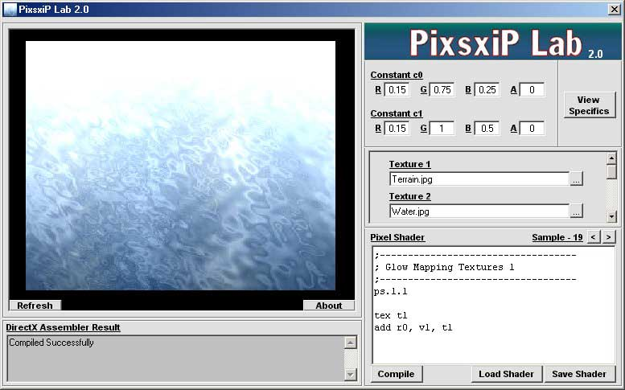



## PixsxiP Lab 2\.0 \(DX8 Pixel Shader Lab\) Now With 35 Samples\! \+ More

### Description

This version revised some poor logic code, now has 35 samples, list most of the funtions used in pixel shader programing, more textures can be loaded, more stable, and bug fixes. Please note - most video cards do not handle pixel shaders yet. If your does not, the result will stay black. This program has been tested on - Winows ME, 900 mhz, 128mb ram, 64 mb GeForce 4. Thats it. Please leave comments and suggestions. If you like it please vote. My next task is a pixel shader lab.

-Enjoy-
 
### More Info
 

             |
---                |---
**Submitted On**   |2002-07-25 12:36:38
**By**             |[James Dougherty](https://github.com/Planet-Source-Code/PSCIndex/blob/master/ByAuthor/james-dougherty.md)
**Level**          |Advanced
**User Rating**    |5.0 (25 globes from 5 users)
**Compatibility**  |VB 6\.0
**Category**       |[DirectX](https://github.com/Planet-Source-Code/PSCIndex/blob/master/ByCategory/directx__1-44.md)
**World**          |[Visual Basic](https://github.com/Planet-Source-Code/PSCIndex/blob/master/ByWorld/visual-basic.md)
**Archive File**   |[PixsxiP\_La1106677252002\.zip](https://github.com/Planet-Source-Code/james-dougherty-pixsxip-lab-2-0-dx8-pixel-shader-lab-now-with-35-samples-more__1-37248/archive/master.zip)

